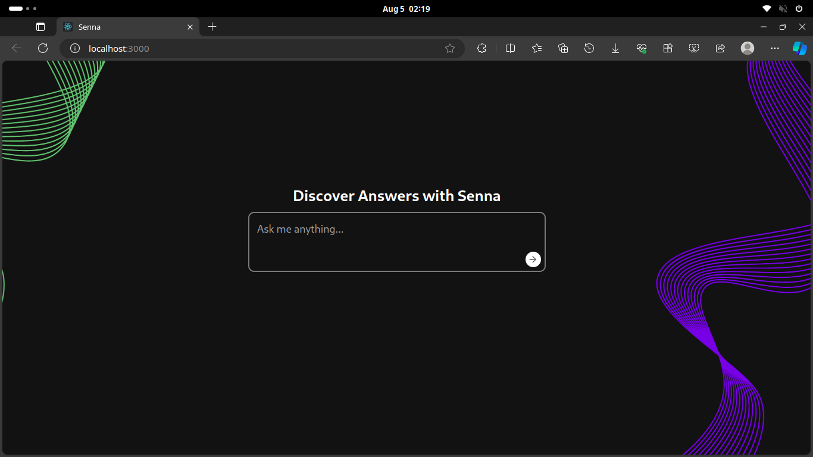

# Senna
Senna is an AI-powered search engine designed to provide users with accurate and relevant information quickly, similar to platforms like You.com and Perplexity. Leveraging advanced natural language processing techniques, Senna aggregates data from various online sources to deliver comprehensive answers to user queries.



## Features

- **AI-Powered Responses**: Utilizes state-of-the-art language models to generate human-like answers based on user queries.
  
- **Real-Time Information**: Fetches up-to-date information from the web, ensuring users receive the most current and relevant results.

- **User-Friendly Interface**: Designed with a clean and intuitive interface for easy navigation and efficient search experiences.

- **Contextual Understanding**: Analyzes the context of user queries to provide more accurate and relevant search results.

## How It Works

Senna operates by following these steps:

1. **User Query**: The user inputs a query into the search bar.
  
2. **Data Retrieval**: Senna scrapes relevant information from various web pages and databases.

3. **Response Generation**: The system constructs a prompt using the query and fetched data, then calls a language model API to generate a coherent answer.

4. **Display Results**: The generated answer is displayed to the user, along with links to the sources for further reading.

## Installation

To run Senna locally, follow these steps:

1. **Clone the Repository**:

   ```bash
   git clone https://github.com/yourusername/senna.git
   ```

2. **Navigate to the Project Directory**:

   ```bash
   cd senna
   ```

3. **Install Dependencies**:

   ```bash
   npm install
   ```

4. **Run the Application**:

   ```bash
   npm start
   ```

## Usage

Once the application is running, you can access it via your web browser. Simply enter your query in the search bar and press enter to receive AI-generated responses.

## Contributing

We welcome contributions to Senna! If you have suggestions for improvements or find any bugs, please open an issue or submit a pull request. 

### Improvement Ideas

- Integrate additional data sources for broader coverage.
- Enhance the user interface for better usability.
- Implement features for saving and sharing search results.
- Adding support for multiple LLM's.

## License

Senna is open-source software released under the [MIT License](LICENSE).
