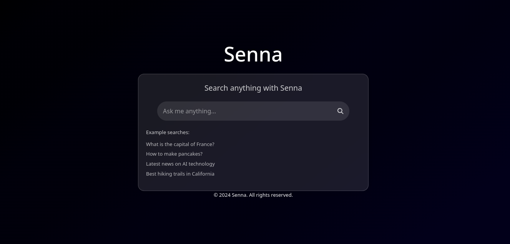
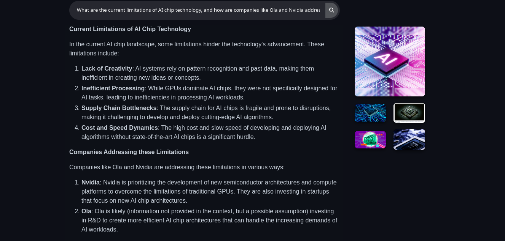

# Senna
# UPDATING SOON!
Senna is an AI-powered search engine designed to provide users with accurate and relevant information quickly, similar to platforms like You.com and Perplexity. Leveraging advanced natural language processing techniques, Senna aggregates data from various online sources to deliver comprehensive answers to user queries.

---------------------------------------------------------------

## Features

- **AI-Powered Responses**: Utilizes state-of-the-art language models to generate human-like answers based on user queries.
  
- **Real-Time Information**: Fetches up-to-date information from the web, ensuring users receive the most current and relevant results.

- **User-Friendly Interface**: Designed with a clean and intuitive interface for easy navigation and efficient search experiences.

- **Contextual Understanding**: Analyzes the context of user queries to provide more accurate and relevant search results.
- Implement features for saving and sharing search results.
- Adding support for multiple LLM's.

## License

Senna is open-source software released under the [MIT License](LICENSE).
